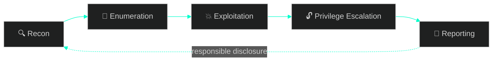

<!-- ================= HEADER ================= -->

<p align="center">
  
</p>

<p align="center">
  
</p>

<p align="center">
  <a href="https://www.linkedin.com/in/rushabh-borisagar-9b734426a/"></a>
  <a href="https://github.com/BorisagarRushabh"></a>
  
</p>

<p align="center">
  
</p>

<p align="center">
  <em>"Real hackers don't rely on tools — they understand how systems actually work."</em>
</p>

---

### `[0x00]` root@rushabh:~$ cat profile.txt

```
NAME        : Rushabh Borisagar
ROLE        : Offensive Security Enthusiast / Aspiring Red Teamer
FOCUS       : Web Application Pentesting · Android Security
METHOD      : Manual exploitation first, tooling second
MISSION     : Break it. Understand it. Report it responsibly.
STATUS      : [ONLINE] — probing endpoints, decompiling APKs, chasing CVEs
```

---

### `[0x01]` Attack Methodology



---

### `[0x02]` Exploitation Arsenal

<table>
<tr>
<td width="50%" valign="top">

**🌐 Web Application Attacks**
- SQL Injection — manual & advanced logic-based
- Cross-Site Scripting (Reflected / Stored / DOM)
- Command Injection
- Authentication & Session Management Flaws
- Business Logic Abuse

</td>
<td width="50%" valign="top">

**📱 Android Security**
- SSL Pinning Bypass (Frida / Objection)
- Dynamic Instrumentation & Runtime Analysis
- Traffic Interception (Burp Suite)
- Static Analysis & Reverse Engineering (JADX)

</td>
</tr>
</table>

<p align="center">
  
</p>

<div align="center">

`Burp Suite` · `Nmap` · `Wireshark` · `Frida` · `Objection` · `JADX` · `Metasploit`

</div>

---

### `[0x03]` Active Payloads (Projects)

<details open>
<summary><b>🔥 Web Application Firewall (WAF) — Python / Flask</b></summary>
<br>

A self-built request-filtering engine that thinks like an attacker to defend like one.

- Real-time detection & blocking of SQLi, XSS, and command injection
- Custom rule-based filtering engine (no black-box dependencies)
- Live logging & monitoring dashboard for blocked requests

</details>

<details>
<summary><b>🤖 Jarvis — Offensive Edition</b></summary>
<br>

A voice-controlled assistant evolving into a recon co-pilot.

- Voice-driven automation core with AI integration
- Nmap-based scanning module *(in progress)*
- Roadmap: automated recon & enumeration pipeline

</details>

<details>
<summary><b>📱 Android Pentesting Lab</b></summary>
<br>

A personal range for tearing apart mobile apps safely.

- SSL pinning bypass lab (Frida scripts + rooted emulator)
- Full traffic interception setup (Burp + Magisk + Frida)
- Reverse engineering workflows for APK analysis

</details>

---

### `[0x04]` Bug Bounty & Research

<p align="left">
  
  
  
</p>

Hunting on live targets, focused on real-world web vulnerabilities and the logic flaws automated scanners miss.

---

### `[0x05]` Current Objectives

- [ ] Master advanced web exploitation techniques
- [ ] Deep-dive into Android security testing methodology
- [ ] Ship custom offensive security tooling
- [ ] Land high-impact bug bounty reports
- [ ] Break into Red Team / Offensive Security Engineering

---

### `[0x06]` Stats

<p align="center">
  
</p>

---

<p align="center">
  <sub>⚠️ All testing performed within authorized scopes (bug bounty programs, personal labs, CTFs). No systems were harmed that didn't consent to it.</sub>
</p>

<p align="center">
  
</p>
